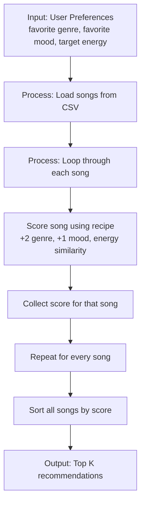

# 🎵 Music Recommender Simulation

## Project Summary

In this project you will build and explain a small music recommender system.

Your goal is to:

- Represent songs and a user "taste profile" as data
- Design a scoring rule that turns that data into recommendations
- Evaluate what your system gets right and wrong
- Reflect on how this mirrors real world AI recommenders

This project simulates a small music recommender by representing songs and user preferences as structured data and scoring songs based on how well they match a user profile. It also reflects how real streaming platforms make recommendations by combining signals from both user behavior and song characteristics.

## Research Summary: How Streaming Platforms Predict What You’ll Love Next

Major platforms such as Spotify and YouTube typically recommend content using a mix of recommendation strategies. Two of the most important are:

- Collaborative filtering: This method uses the behavior of many users to find patterns. If users who like similar songs also enjoy a certain track, that track may be recommended. It is based on signals such as likes, saves, skips, playlist additions, repeat listens, and watch time.
- Content-based filtering: This method uses the properties of the item itself. For music, this can include genre, artist, tempo, mood, energy, acousticness, language, and other audio or metadata features. The system recommends songs that are similar to those a user already enjoys.

In practice, large platforms often use hybrid systems that combine both approaches. Collaborative filtering is strong at finding hidden preferences across users, while content-based filtering works well when there is limited user history or when the system needs to recommend new or niche items.

### Prompt to Ask an AI About This Topic

You can use a prompt like this to gather a clear explanation:

> Research how Spotify and YouTube recommend content to users. Compare collaborative filtering and content-based filtering, and explain the difference between them. Specifically, describe how collaborative filtering uses other users’ behavior, while content-based filtering uses item attributes such as genre, tempo, mood, and metadata. Also list the main data types involved, including likes, skips, playlists, plays, tempo, mood, and artist or genre information.

### Main Data Types Used in These Systems

- Interaction data: likes, dislikes, skips, plays, repeat plays, playlist saves, follows, and completion/watch time
- Behavioral data: listening history, search history, session patterns, and time-of-day activity
- Content data: genre, artist, tempo, mood, energy, acousticness, language, duration, and other song or video attributes
- Contextual data: device type, recent activity, and current session context

---

## How The System Works

### Real-World Context
Streaming platforms like Spotify recommend songs using content-based filtering, which matches songs to your taste profile based on their inherent attributes (genre, mood, energy, acousticness, etc.). While real platforms combine this with collaborative filtering (what other users liked), our simulation focuses on content-based scoring to show how a single song can be evaluated against a user's preferences using a transparent, math-based scoring rule. Instead of a "black box" algorithm, we use weighted features and proximity scoring—particularly a Gaussian function for numerical values like energy—so you can see exactly why a song was recommended.

### Features Used

**Song Attributes** (from music metadata):
- `genre` — Music category (e.g., pop, rock, indie, jazz, lofi)
- `mood` — Emotional tone (e.g., happy, sad, chill, energetic)
- `energy` — Intensity level (0–1 scale; 0=calm, 1=intense)
- `acousticness` — How acoustic vs. produced (0–1 scale; 0=electric, 1=purely acoustic)
- `tempo_bpm` — Beats per minute (available but optional in scoring)
- `valence` — Musical positivity/brightness (available but optional in scoring)
- `danceability` — How suitable for dancing (available but optional in scoring)
- Plus: `id`, `title`, `artist` for identification

**User Profile** (your taste preferences):
- `favorite_genre` — Which genre you prefer (e.g., "pop")
- `favorite_mood` — Which mood you prefer (e.g., "happy")
- `target_energy` — Your ideal energy level (0–1 scale)
- `likes_acoustic` — Boolean: do you prefer acoustic instruments?

### Scoring Rule
Each song gets a **single numerical score** using this finalized algorithm recipe:
1. **Genre Match**: +2.0 points if the song genre matches the user's favorite genre.
2. **Mood Match**: +1.0 point if the song mood matches the user's favorite mood.
3. **Energy Similarity**: Add a bonus based on how close the song's energy is to the user's target energy. The closer the match, the higher the bonus.
4. **Acoustic Preference**: This is a secondary signal and can be used to refine the ranking, but the main recipe is driven by genre, mood, and energy.

### Ranking Rule
To get recommendations, the system **scores all songs** using this recipe, then **sorts them by score** (highest first), and returns the top *k* songs. This is why we need both a scoring rule (for one song) and a ranking rule (for a ranked list).

### Expected Biases
This system may over-prioritize genre, since genre carries the largest point reward. That means it could miss great songs that do not match the user's genre exactly but still fit their mood or energy very well. It also depends heavily on the user's stated preferences, so it may be less flexible when a person has broad or changing tastes.

### Data Flow


---

## Getting Started

### Setup

1. Create a virtual environment (optional but recommended):

   ```bash
   python -m venv .venv
   source .venv/bin/activate      # Mac or Linux
   .venv\Scripts\activate         # Windows

2. Install dependencies

```bash
pip install -r requirements.txt
```

3. Run the app:

```bash
python -m src.main
```

### Running Tests

Run the starter tests with:

```bash
pytest
```

You can add more tests in `tests/test_recommender.py`.

---

## Sample Recommendation Output

The terminal output below was produced by running the recommender locally with the current dataset:

### High-Energy Pop

```text
High-Energy Pop:

1. Sunrise City
   Score: 3.96
   Why:
      - Sunrise City - Neon Echo
      -   genre match (+2.0)
      -   mood match (+1.0)
      -   energy similarity (+0.96)

2. Gym Hero
   Score: 2.74
   Why:
      - Gym Hero - Max Pulse
      -   genre match (+2.0)
      -   mood mismatch (+0.0)
      -   energy similarity (+0.74)

3. Rooftop Lights
   Score: 1.92
   Why:
      - Rooftop Lights - Indigo Parade
      -   genre mismatch (+0.0)
      -   mood match (+1.0)
      -   energy similarity (+0.92)

4. Hip Hop Flow
   Score: 0.98
   Why:
      - Hip Hop Flow - Urban Pulse
      -   genre mismatch (+0.0)
      -   mood mismatch (+0.0)
      -   energy similarity (+0.98)

5. Night Drive Loop
   Score: 0.90
   Why:
      - Night Drive Loop - Neon Echo
      -   genre mismatch (+0.0)
      -   mood mismatch (+0.0)
      -   energy similarity (+0.90)
```

### Chill Lofi

```text
Chill Lofi:

1. Midnight Coding
   Score: 3.96
   Why:
      - Midnight Coding - LoRoom
      -   genre match (+2.0)
      -   mood match (+1.0)
      -   energy similarity (+0.96)

2. Library Rain
   Score: 3.90
   Why:
      - Library Rain - Paper Lanterns
      -   genre match (+2.0)
      -   mood match (+1.0)
      -   energy similarity (+0.90)

3. Focus Flow
   Score: 3.00
   Why:
      - Focus Flow - LoRoom
      -   genre match (+2.0)
      -   mood mismatch (+0.0)
      -   energy similarity (+1.00)

4. Spacewalk Thoughts
   Score: 1.76
   Why:
      - Spacewalk Thoughts - Orbit Bloom
      -   mood match (+1.0)
      -   energy similarity (+0.76)

5. Classical Piano
   Score: 0.96
   Why:
      - Classical Piano - Symphony Dreams
      -   genre mismatch (+0.0)
      -   mood mismatch (+0.0)
      -   energy similarity (+0.96)
```

### Deep Intense Rock

```text
Deep Intense Rock:

1. Storm Runner
   Score: 3.98
   Why:
      - Storm Runner - Voltline
      -   genre match (+2.0)
      -   mood match (+1.0)
      -   energy similarity (+0.98)

2. Gym Hero
   Score: 1.94
   Why:
      - Gym Hero - Max Pulse
      -   genre mismatch (+0.0)
      -   mood match (+1.0)
      -   energy similarity (+0.94)

3. Electronic Dreams
   Score: 0.96
   Why:
      - Electronic Dreams - Synthetic Wave
      -   genre mismatch (+0.0)
      -   mood mismatch (+0.0)
      -   energy similarity (+0.96)

4. Disco Fever
   Score: 0.92
   Why:
      - Disco Fever - Retro Groove
      -   genre mismatch (+0.0)
      -   mood mismatch (+0.0)
      -   energy similarity (+0.92)

5. Sunrise City
   Score: 0.84
   Why:
      - Sunrise City - Neon Echo
      -   genre mismatch (+0.0)
      -   mood mismatch (+0.0)
      -   energy similarity (+0.84)
```

**Screenshot or video** *(optional)*: <!-- Insert a screenshot or demo video link here -->

---

## Experiments You Tried

Use this section to document the experiments you ran. For example:

- What happened when you changed the weight on genre from 2.0 to 0.5
- What happened when you added tempo or valence to the score
- How did your system behave for different types of users

### Musical Intuition Check: Motivational Music

For a profile like High-Energy Pop, the recommendations feel mostly right for someone who likes motivational music. Songs such as Sunrise City and Gym Hero are energetic and upbeat, which matches the kind of sound I would expect for a driving or focus playlist. The results also make sense because the scoring system strongly rewards genre, mood, and energy together, so a high-energy, happy profile naturally gets music that feels inspiring.

That said, the system is still fairly simple. It may miss songs that are motivational for other reasons—such as a slower but emotionally powerful track—or over-rank songs that are energetic but not especially meaningful. In that sense, the recommendations feel intuitive, but not yet fully human-like.

---

## Limitations and Risks

Summarize some limitations of your recommender.

Examples:

- It only works on a tiny catalog
- It does not understand lyrics or language
- It might over favor one genre or mood

You will go deeper on this in your model card.

---

## Reflection

Read and complete `model_card.md`:

[**Model Card**](model_card.md)

Write 1 to 2 paragraphs here about what you learned:

- about how recommenders turn data into predictions
- about where bias or unfairness could show up in systems like this

My biggest learning moment came when I realized that engineering a recommender system is less about chasing perfect algorithmic accuracy and more about making design assumptions visible. At first, the scoring logic seemed straightforward. However, once I started testing the system against different user profiles, I saw how minor design choices—like how heavily to weight an exact genre match versus a behavioral attribute like energy—completely shifted the output. It shifted my perspective from just writing code that "works" to evaluating the real-world consequences of how structured data is transformed into rankings.  AI tools were incredibly helpful for scaffolding the modular Python architecture, generating diverse song datasets, and quickly spinning up pytest testing suites to validate my logic. However, I had to double-check them closely when it came to the actual recommendation outputs. AI-generated code would often run perfectly from a technical standpoint but fail the human "sanity check."


I was surprised by how much personalized "magic" could be generated by relatively simple algorithms. By just calculating basic distance or similarity scores across a handful of features like genre, mood, and energy, the system generated noticeably distinct recommendation lists that felt genuinely tailored. It proved that you don't necessarily need a massive, opaque deep-learning model to build something that feels responsive and intuitive to a human reader; careful feature matching can go a long way. If I were to extend this project, I would focus on breaking out of the "filter bubble" by intentionally engineering serendipity and fairness into the system. Right now, the logic heavily rewards exact matches, which can make recommendations feel too narrow over time. Next, I want to implement a "discovery multiplier" that introduces highly-rated songs from outside a user's primary genres based on cross-over appeal.


